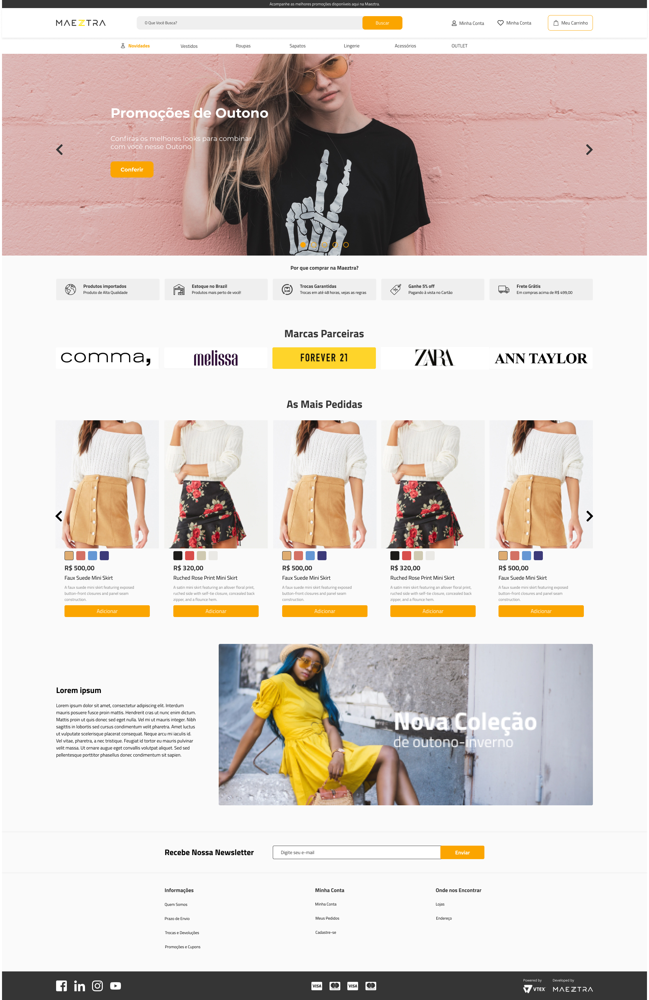

  <h1 align="center"> Maeztra </h1>

  

    Maeztra é um projeto de Vendas online.  
  

  

    <a href="#-tecnologias">Tecnologias</a>&nbsp;&nbsp;&nbsp;|&nbsp;&nbsp;&nbsp;
    <a href="#-projeto">Projeto</a>&nbsp;&nbsp;&nbsp;|&nbsp;&nbsp;&nbsp;
    <a href="#-layout">Layout</a>&nbsp;&nbsp;&nbsp;|&nbsp;&nbsp;&nbsp;
    <a href="#memo-licença">Licença</a>
  

  

    
  

   

  

    
  

## 🚀 Tecnologias

Esse projeto foi desenvolvido com as seguintes tecnologias:

- HTML e CSS
- JavaScript
- Node.js
- Git e Github
- Figma

## 💻 Projeto

Maeztra é um loja de Vendas online.

- [visite o projeto online](https://javii21.github.io/projeto-maeztra/)

## 🔖 Layout

Você pode visualizar o layout do projeto através [DESSE LINK](https://www.figma.com/file/3RqPfS5PW9whbQNCTTaoqA/%5B2020-09%5D-MZ---Layout-Teste-de-vagas-para-time-de-Devs?node-id=0%3A1&t=hKBTRihmlPSmxLj8-0). É necessário ter conta no [Figma](https://figma.com) para acessá-lo.

## :memo: Licença

Esse projeto está sob a licença Javier.

---

Feito com ♥ by Javier Romero  
